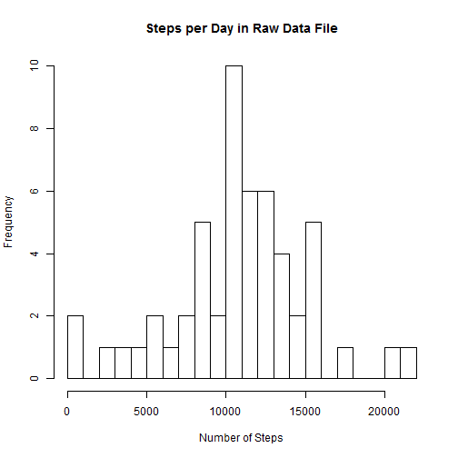
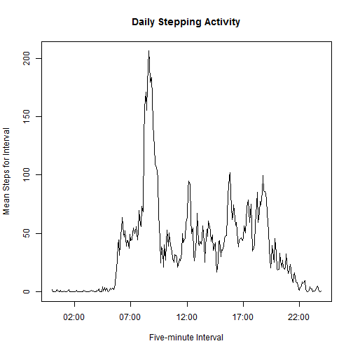
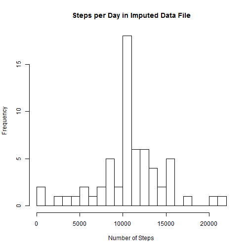
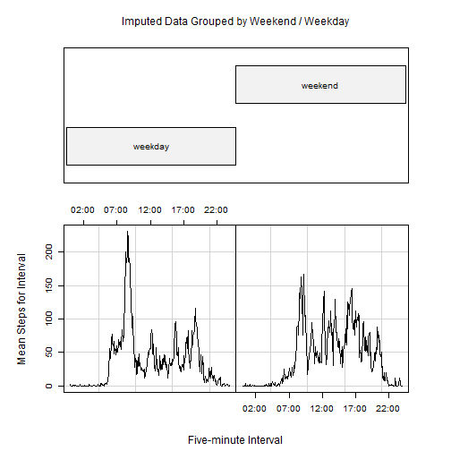

## Loading and preprocessing the data
### Load Libraries

```r
library(data.table)
```

```
## data.table 1.9.4  For help type: ?data.table
## *** NB: by=.EACHI is now explicit. See README to restore previous behaviour.
```

```r
library(lubridate)
```

```
## 
## Attaching package: 'lubridate'
## 
## The following objects are masked from 'package:data.table':
## 
##     hour, mday, month, quarter, wday, week, yday, year
```

```r
library(dplyr)
```

```
## 
## Attaching package: 'dplyr'
## 
## The following objects are masked from 'package:lubridate':
## 
##     intersect, setdiff, union
## 
## The following objects are masked from 'package:data.table':
## 
##     between, last
## 
## The following object is masked from 'package:stats':
## 
##     filter
## 
## The following objects are masked from 'package:base':
## 
##     intersect, setdiff, setequal, union
```

```r
library(stringr)
library(ggplot2)
```
### Read in the data

```r
activity_raw <- read.csv("activity.csv")  
```

## What is mean total number of steps taken per day?

```r
daily_act_raw <- tapply(activity_raw$steps, activity_raw$date, FUN=sum)
```

## Show a histogram of total steps per day

```r
hist(daily_act_raw, breaks = 20, freq = NULL, main="Steps per Day in Raw Data File", xlab="Number of Steps", ylab="Frequency")
```

 
  
### format inline output so that numbers arent in scientific notation

```r
options(scipen = 1, digits = 2)
```

### mean daily steps

```r
mean_steps <- mean(daily_act_raw, na.rm = TRUE)
```
The mean number of steps each day is 10766.   

### median daily steps

```r
med_steps <- median(daily_act_raw, na.rm = TRUE)
```
The median number of steps each day is 10765.   

## What is the average daily activity pattern?
Add a variable that makes the hours show up correctly in the plot and make a new dataset that we can manipulate without affecting the source dataset

```r
actdata <- activity_raw
actdata$newinterval <- ymd_hm(paste("2000-01-01", str_pad(activity_raw$interval, 4, pad = "0")))
```

And then take that data and create a file that groups it by interval

```r
interval_grps <- group_by(actdata, newinterval, interval)
summry <- data.frame(summarise(interval_grps, mean(steps, na.rm=TRUE)))
```

Change the name of the resultant step summary field to make it easier to manipulate

```r
summry$meansteps <- summry$mean.steps..na.rm...TRUE.
```

Plot that to see what is going on  

```r
plot(summry$newinterval, summry$meansteps, type="l", main="Daily Stepping Activity", ylab="Mean Steps for Interval", xlab="Five-minute Interval")
```

 

And the interval with the maximum number of average steps  

```r
maxstepint <- summry$interval[which.max(summry$meansteps)]
```

The interval with the most steps, on average, is interval number 835.    

## Imputing missing values
1. Calculate and report the total number of missing values in the dataset (i.e. the total number of rows with `NA`s)

```r
numnas <- sum(is.na(activity_raw$steps))
```
There are 2304 NAs in the dataset.   

2. Devise a strategy for filling in all of the missing values in the dataset. The strategy does not need to be sophisticated. For example, you could use the mean/median for that day, or the mean for that 5-minute interval, etc.

My strategy is to take the average number of daily steps for each interval and apply those numbers to any intervals with missing values.  So, if interval 835 (the interval with the maximum average number of steps) were to have an NA in it for a particular interval on a particular day, that NA would be replaced by the 216.

3. Create a new dataset that is equal to the original dataset but with the missing data filled in.


```r
actDataImputed <- activity_raw
i <- 1
while(i < 17569) {
  if(is.na(actDataImputed$steps[i])) {
	actDataImputed$steps[i] <- summry$meansteps[which(actDataImputed$interval[i]==summry$interval)]
	}
	i <- i+1
}
```

### Sum these steps for each day

```r
dayactDataImputed <- tapply(actDataImputed$steps, actDataImputed$date, FUN=sum)
```

4. Make a histogram of the total number of steps taken each day and Calculate and report the **mean** and **median** total number of steps taken per day. Do these values differ from the estimates from the first part of the assignment? What is the impact of imputing missing data on the estimates of the total daily number of steps?  


```r
hist(dayactDataImputed, breaks = 20, freq = NULL, main="Steps per Day in Imputed Data File", xlab="Number of Steps", ylab="Frequency")
```

 

### mean daily steps

```r
imp_mean_steps <- mean(dayactDataImputed, na.rm = TRUE)
```

The mean number of steps each day is 10766.   

### median daily steps  

```r
imp_med_steps <- median(dayactDataImputed, na.rm = TRUE)
```

The median number of steps each day is 10766.19.  

The mean number of daily steps is the same, but in the imputed file, the median crept up slightly.  This makes sense because the mean was used to generate each imputed value, whereas the median has to go up with every NA that is replaced by an actual value.  The median would only decline if we were replacing high values with something lower than the median.  

## Are there differences in activity patterns between weekdays and weekends?
Add a field that is a factor describing day of week

```r
actDataImputed$weekend <- ifelse(weekdays(as.Date(actDataImputed$date)) %in% c("Saturday", "Sunday"), "weekend", "weekday")
```

Add the formatted interval to the imputed file

```r
actDataImputed$newinterval <- ymd_hm(paste("2000-01-01", str_pad(activity_raw$interval, 4, pad = "0")))
```

And then take that data and create a file that groups it by interval

```r
interval_grps <- group_by(actDataImputed, newinterval, weekend, interval)
impsummry <- data.frame(summarise(interval_grps, mean(steps, na.rm=TRUE)))
```

Change the name of the resultant step summary field to make it easier to manipulate

```r
impsummry$meansteps <- impsummry$mean.steps..na.rm...TRUE.
```

## Plot weekend and weekday data separately

```r
coplot(meansteps ~ newinterval|weekend, type="l", data=impsummry, ylab="Mean Steps for Interval", xlab = c("Five-minute Interval", "Imputed Data Grouped by Weekend / Weekday")) 
```

 

